# DeepRL

## Overview

This repository contains the implementation of Deep Reinforcement Learning (RL) algorithms, Deep Q-Networks (DQN) and its improved variant. The projects involve solving various environments, from simple grid worlds to complex tasks like balancing a pole and navigating a car on a mountain. These environments aim to demonstrate the effectiveness of RL algorithms and provide insights into their performance on different tasks.

## 💻 Team Members

-   Charvi Kusuma [GitHub](https://github.com/kcharvi)
-   Tarun Reddi [GitHub](https://github.com/REDDITARUN)

### Real-World Application

Deep RL is a crucial area of artificial intelligence that enables agents to make decisions in complex, dynamic environments. By working on these you will gain hands-on experience with value function approximation, experience replay, and target networks. This github project is useful for understanding how RL can be applied to real-world problems, such as robotics, game playing, and autonomous driving.

### Concepts Learned

1. **Deep Q-Learning (DQN)**: Implementation of the DQN algorithm from scratch.
2. **Experience Replay**: Using a replay buffer to store and sample experiences.
3. **Target Networks**: Using a separate target network to stabilize training.
4. **Improved DQN Variants**: Implementing Double DQN (DDQN) and other advanced techniques.
5. **OpenAI Gym Environments**: Working with various Gym environments to test and validate RL algorithms.

### Usage and Outcomes

-   **Grid World**: Implemented a custom grid world environment and solved it using DQN and DDQN.
-   **CartPole**: Applied DQN and DDQN to balance a pole on a cart, demonstrating the ability to learn dynamic control tasks.
-   **Mountain Car**: Solved the Mountain Car problem, showcasing the challenges of sparse rewards and the importance of strategic exploration.

## Project Structure

-   **Introduction to Deep Reinforcement Learning**: Setting up neural networks for the Wumpus World environment.
-   **Implementing DQN**: Solving grid-world, CartPole, and Mountain Car environments with DQN.
-   **Improving DQN**: Implementing and evaluating Double DQN on the same environments.

## Deep Q-Learning (DQN)

### Environment Descriptions

#### 1. Grid World

Refer to the <a src="https://github.com/kcharvi/Defining-and-Solving-Reinforcement-Learning-Environments">Repo - Defining and Solving Reinforcement Learning Environments</a> for more details on the frozen lake environment.

-   **States**: Positions on the grid, including start, goal, holes, and gems.
-   **Actions**: Move left, right, up, or down.
-   **Rewards**: Positive rewards for reaching the goal and collecting gems; negative rewards for falling into holes or moving away from the goal.

#### 2. CartPole

-   **States**: Cart position, cart velocity, pole angle, and pole angular velocity.
-   **Actions**: Push the cart left or right.
-   **Rewards**: +1 for each time step the pole remains upright; episode terminates if the pole angle exceeds a threshold or the cart moves outside the track bounds.

#### 3. Mountain Car

-   **States**: Car position and velocity.
-   **Actions**: Accelerate forwards, backwards, or do nothing.
-   **Rewards**: -1 for each time step until the goal state is reached; episode terminates when the car reaches the top of the higher mountain.

### Algorithms and Implementation

#### Benefits of Using DQN

-   **Experience Replay**: Breaks the correlation between consecutive experiences by sampling random mini-batches from a replay buffer.
-   **Target Network**: Provides stable Q-value targets, reducing oscillations and divergence during training.
-   **Q-Function Approximation**: Uses neural networks to approximate the Q-function, allowing for generalization across similar states and scalability to high-dimensional input spaces.

#### Results and Discussions

1. **Frozen Lake Environment**
   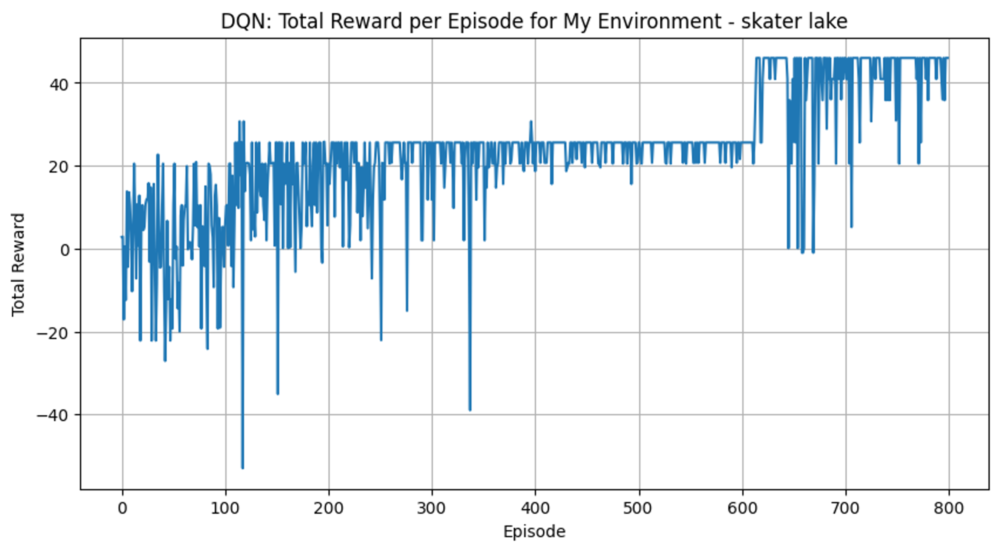

    - **Total Rewards per Episode**: Gradually increasing, indicating effective learning.
    - **Epsilon Decay**: Smooth exponential decay, showing a transition from exploration to exploitation.

2. **CartPole Environment**
   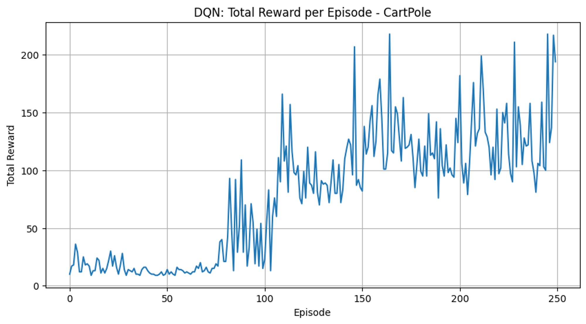

    - **Total Rewards per Episode**: Gradual improvement with some fluctuations, suggesting ongoing exploration and learning.
    - **Epsilon Decay**: Reflects the agent's increasing reliance on its learned policy.

3. **Mountain Car Environment**
   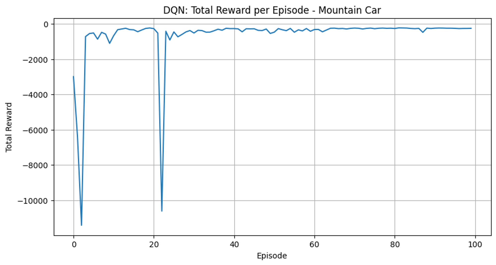
    - **Total Rewards per Episode**: Consistently negative, indicating the challenging nature of the environment.
    - **Epsilon Decay**: Rapid shift from exploration to exploitation.

### Evaluation Results

1. **Frozen Lake**
   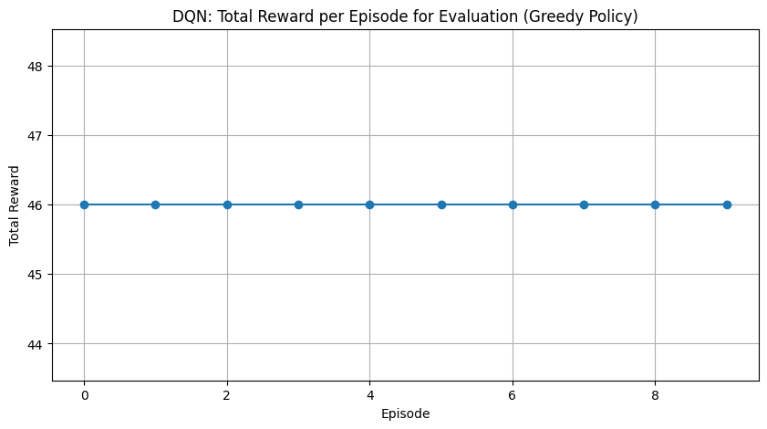
2. **CartPole**
   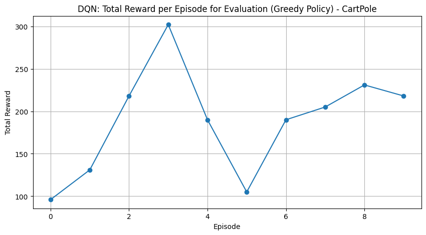
3. **Mountain Car**
   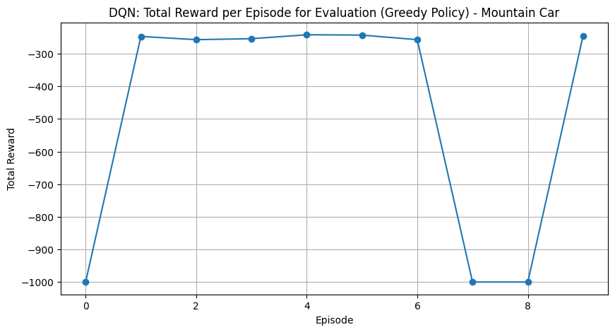

### Interpretation of Results

-   **Grid World**: Stable policy achieved, reflecting the simplicity of the environment.
-   **CartPole**: Improvements over time but with inconsistency, highlighting the need for further training.
-   **Mountain Car**: Struggles due to sparse rewards and the need for strategic exploration.

## Project 2 - Improving DQN with Double DQN (DDQN)

### Algorithm Implementation

-   **DDQN**: Enhances DQN by using two networks: one for selecting the best action (policy network) and another for evaluating that action's value (target network).

### Results and Discussions

1. **Frozen Lake Environment**
   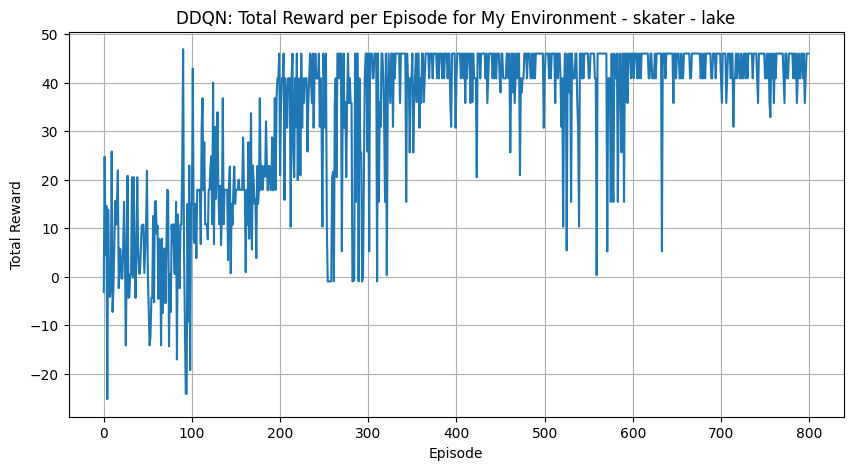

    - **Total Rewards per Episode**: Similar trends to DQN with slight improvements.
    - **Epsilon Decay**: Sharp decrease indicating a shift towards exploitation.

2. **CartPole Environment**
   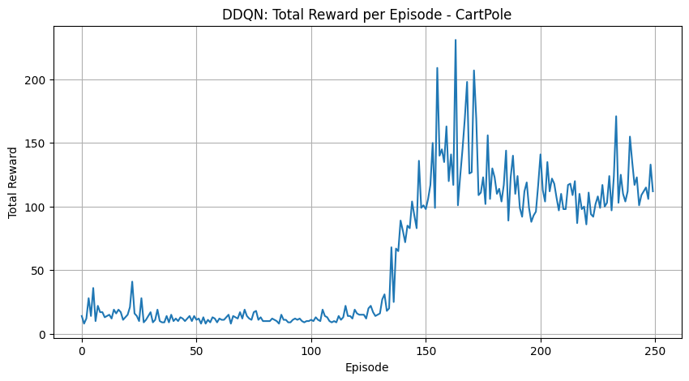

    - **Total Rewards per Episode**: More stable and higher rewards compared to DQN.
    - **Epsilon Decay**: Consistent with DQN but shows better performance.

3. **Mountain Car Environment**
   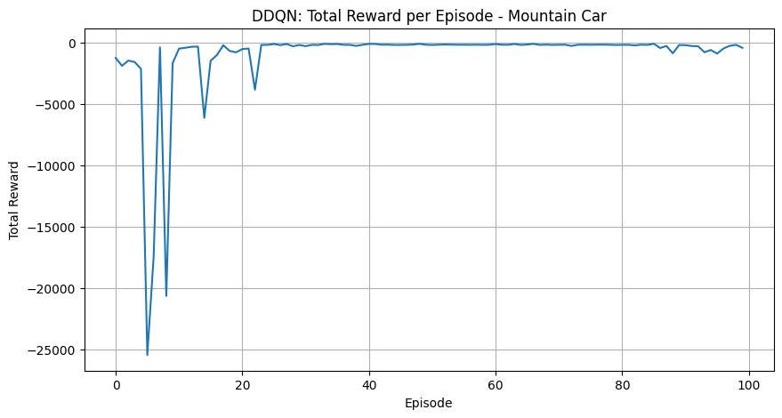
    - **Total Rewards per Episode**: Similar struggles as DQN but with occasional better performance.

### Evaluation Results

1. **Frozen Lake**
   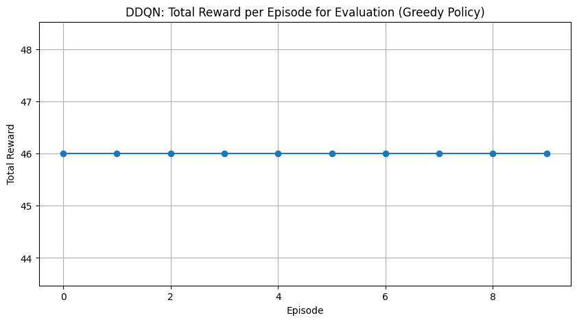
2. **CartPole**
   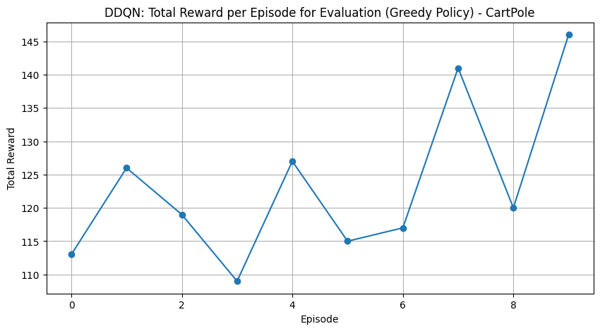
3. **Mountain Car**
   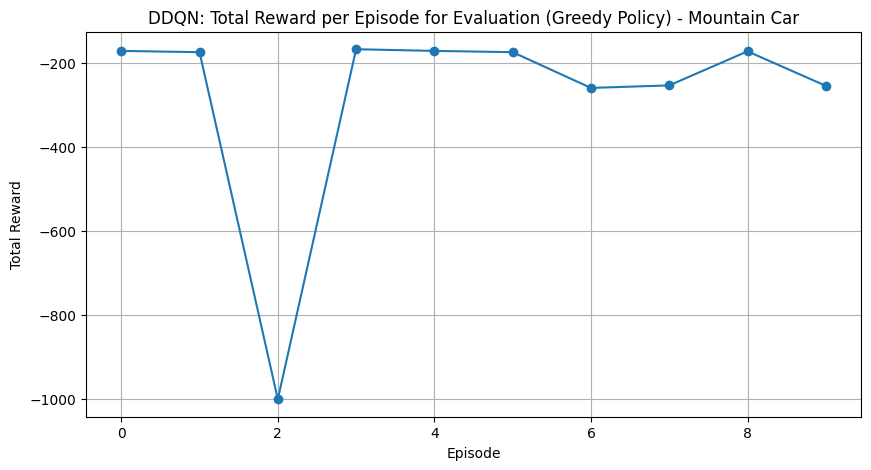

### Comparison of DQN and DDQN

-   **Grid World**: DDQN converges faster to an optimal policy.
-   **CartPole**: DDQN shows more stability and consistent performance.
-   **Mountain Car**: DDQN occasionally performs better but struggles overall, indicating the need for further enhancements.

1. **Frozen Lake**
   .png>)
   .png>)
2. **CartPole**
   .png>)
   .png>)
3. **Mountain Car**
   .png>)
   .png>)

## References

-   [Deep Q-Learning (DQN)](https://arxiv.org/abs/1312.5602)
-   [Double DQN](https://arxiv.org/abs/1509.06461)
-   [OpenAI Gym](https://gym.openai.com/)
-   [PyTorch Documentation](https://pytorch.org/tutorials/intermediate/reinforcement_q_learning.html)
