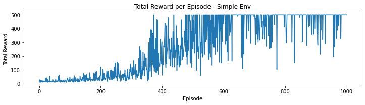

# DeepRL

## Overview

This repository contains the implementation of Deep Reinforcement Learning (RL) algorithms, Deep Q-Networks (DQN) and its improved variant. The projects involve solving various environments, from simple grid worlds to complex tasks like balancing a pole and navigating a car on a mountain. These environments aim to demonstrate the effectiveness of RL algorithms and provide insights into their performance on different tasks.

## 💻 Team Members

-   Charvi Kusuma [GitHub](https://github.com/kcharvi)
-   Tarun Reddi [GitHub](https://github.com/REDDITARUN)

### Real-World Application

Deep RL is a crucial area of artificial intelligence that enables agents to make decisions in complex, dynamic environments. By working on these you will gain hands-on experience with value function approximation, experience replay, and target networks. This github project is useful for understanding how RL can be applied to real-world problems, such as robotics, game playing, and autonomous driving.

### Concepts Learned

1. **Deep Q-Learning (DQN)**: Implementation of the DQN algorithm from scratch.
2. **Experience Replay**: Using a replay buffer to store and sample experiences.
3. **Target Networks**: Using a separate target network to stabilize training.
4. **Improved DQN Variants**: Implementing Double DQN (DDQN) and other advanced techniques.
5. **OpenAI Gym Environments**: Working with various Gym environments to test and validate RL algorithms.
6. **Actor-Critic (A2C)**: Combining policy gradient and value-based methods for improved learning.

### Usage and Outcomes

-   **Grid World**: Implemented a custom grid world environment and solved it using DQN and DDQN.
-   **CartPole**: Applied DQN and DDQN to balance a pole on a cart, demonstrating the ability to learn dynamic control tasks.
-   **Mountain Car**: Solved the Mountain Car problem, showcasing the challenges of sparse rewards and the importance of strategic exploration.
-   **Bipedal Walker**: Tackled the Bipedal Walker environment, showing the application of Actor-Critic methods in continuous action spaces.

## Project Structure

-   **Introduction to Deep Reinforcement Learning**: Setting up neural networks for the Wumpus World environment.
-   **Implementing DQN**: Solving grid-world, CartPole, and Mountain Car environments with DQN.
-   **Improving DQN**: Implementing and evaluating Double DQN on the same environments.
-   **Actor-Critic**: Implementing and evaluating A2C on CartPole, Bipedal Walker, and Grid World environments.

## Deep Q-Learning (DQN)

### Environment Descriptions

#### 1. Grid World

Refer to the <a src="https://github.com/kcharvi/Defining-and-Solving-Reinforcement-Learning-Environments">Repo - Defining and Solving Reinforcement Learning Environments</a> for more details on the frozen lake environment.

-   **States**: Positions on the grid, including start, goal, holes, and gems.
-   **Actions**: Move left, right, up, or down.
-   **Rewards**: Positive rewards for reaching the goal and collecting gems; negative rewards for falling into holes or moving away from the goal.

#### 2. CartPole

-   **States**: Cart position, cart velocity, pole angle, and pole angular velocity.
-   **Actions**: Push the cart left or right.
-   **Rewards**: +1 for each time step the pole remains upright; episode terminates if the pole angle exceeds a threshold or the cart moves outside the track bounds.

#### 3. Mountain Car

-   **States**: Car position and velocity.
-   **Actions**: Accelerate forwards, backwards, or do nothing.
-   **Rewards**: -1 for each time step until the goal state is reached; episode terminates when the car reaches the top of the higher mountain.

### Algorithm and Implementation

#### Benefits of Using DQN

-   **Experience Replay**: Breaks the correlation between consecutive experiences by sampling random mini-batches from a replay buffer.
-   **Target Network**: Provides stable Q-value targets, reducing oscillations and divergence during training.
-   **Q-Function Approximation**: Uses neural networks to approximate the Q-function, allowing for generalization across similar states and scalability to high-dimensional input spaces.

#### Results and Discussions

1. **Frozen Lake Environment**
   

    - **Total Rewards per Episode**: Gradually increasing, indicating effective learning.
    - **Epsilon Decay**: Smooth exponential decay, showing a transition from exploration to exploitation.

2. **CartPole Environment**
   

    - **Total Rewards per Episode**: Gradual improvement with some fluctuations, suggesting ongoing exploration and learning.
    - **Epsilon Decay**: Reflects the agent's increasing reliance on its learned policy.

3. **Mountain Car Environment**
   
    - **Total Rewards per Episode**: Consistently negative, indicating the challenging nature of the environment.
    - **Epsilon Decay**: Rapid shift from exploration to exploitation.

### Evaluation Results

1. **Frozen Lake**
   
2. **CartPole**
   
3. **Mountain Car**
   

### Interpretation of Results

-   **Grid World**: Stable policy achieved, reflecting the simplicity of the environment.
-   **CartPole**: Improvements over time but with inconsistency, highlighting the need for further training.
-   **Mountain Car**: Struggles due to sparse rewards and the need for strategic exploration.

## Improving DQN with Double DQN (DDQN)

### Algorithm Implementation

-   **DDQN**: Enhances DQN by using two networks: one for selecting the best action (policy network) and another for evaluating that action's value (target network).

### Results and Discussions

1. **Frozen Lake Environment**
   

    - **Total Rewards per Episode**: Similar trends to DQN with slight improvements.
    - **Epsilon Decay**: Sharp decrease indicating a shift towards exploitation.

2. **CartPole Environment**
   

    - **Total Rewards per Episode**: More stable and higher rewards compared to DQN.
    - **Epsilon Decay**: Consistent with DQN but shows better performance.

3. **Mountain Car Environment**
   
    - **Total Rewards per Episode**: Similar struggles as DQN but with occasional better performance.

### Evaluation Results

1. **Frozen Lake**
   
2. **CartPole**
   
3. **Mountain Car**
   

### Comparison of DQN and DDQN

-   **Grid World**: DDQN converges faster to an optimal policy.
-   **CartPole**: DDQN shows more stability and consistent performance.
-   **Mountain Car**: DDQN occasionally performs better but struggles overall, indicating the need for further enhancements.

1. **Frozen Lake**
   .png>)
   .png>)
2. **CartPole**
   .png>)
   .png>)
3. **Mountain Car**
   .png>)
   .png>)

## Actor-Critic (A2C)

### Algorithm Implementation

The Actor-Critic (A2C) algorithm combines elements of both policy gradient methods and value-based methods. It uses two neural networks, an actor network, and a critic network, to learn a policy and a value function simultaneously.

#### Actor Network (ANet)

-   **Input Layer**: Takes an input with 4 features.
-   **Hidden Layer**: Expands the input to 128 neurons.
-   **Output Layer**: Reduces the 128 neurons to 2 outputs, representing the probabilities of two possible actions.

#### Critic Network (CNet)

-   **Input Layer**: Also starts with 4 features from the environment.
-   **Hidden Layer**: Processes these through 128 neurons.
-   **Output Layer**: Maps the 128 neurons to a single output, providing a scalar value estimation of the state’s value.

Each network uses a ReLU activation function in the hidden layers to introduce non-linearity. The ANet uses a Softmax function in the output layer to convert logits into action probabilities, while the CNet directly outputs a scalar value without a final activation function.

### Environment Descriptions

#### 1. CartPole-v1

-   **States**: 4-dimensional vector representing the position and velocity of the cart, and the angle and angular velocity of the pole.
-   **Actions**: Discrete, with two possible actions: move left or move right.
-   **Rewards**: +1 for each timestep the pole remains balanced; episode terminates when the pole falls beyond a certain angle or the cart moves too far from the center.

#### 2. BipedalWalker-v3

-   **States**: 24-dimensional vector representing various aspects of the robot's state, such as position, angle, velocity, and angular velocity of its body parts.
-   **Actions**: Continuous, with four possible actions corresponding to the torque applied to each leg joint.
-   **Rewards**: Rewards based on movement, higher rewards for moving forward and penalties for falling or making sharp movements.

#### 3. Grid World

-   **States**: 16-dimensional state vector.
-   **Actions**: Discrete, with four possible actions: left, right, up, down.
-   **Rewards**: Positive rewards for collecting gems and reaching the goal; negative rewards for falling into holes or moving away from the goal.

### Results and Discussions

#### CartPole-v1 Environment

-   Total Rewards per Episode: Increasing rewards, showing the agent's learning progression.

#### BipedalWalker-v3 Environment

.png>)

-   Total Rewards per Episode: Fluctuating rewards, reflecting the environment's complexity.

#### Grid World Environment

.png>)

-   Total Rewards per Episode: Increasing trend, indicating the agent's effective learning of the environment.

### Evaluation Results

#### CartPole

_.png>)

-   Performance: Consistently achieving maximum rewards, indicating a well-learned policy.

#### BipedalWalker

_.png>)

-   Performance: Fluctuating evaluation scores, showing the need for further fine-tuning.

#### Grid World

_.png>)

-   Performance: Optimal rewards consistently, showing a reliable and robust learned policy.

### Comparison of Environments

-   **CartPole**: The agent consistently hit the reward ceiling, showing effective learning and optimal policy.

-   **BipedalWalker**: Fluctuating learning experience due to environment complexity, but overall trend indicates improvement.

-   **Grid World**: Optimal rewards achieved consistently, reflecting the agent's ability to navigate the environment effectively.

## Image-based Environment - Car Racing

Use one of the environments with image representation of the state that requires a utilization of CNN (Convolution Neural Network) for the state preprocessing (e.g. Breakout).

The CarRacing environment falls into this category, where the state is represented by pixels from the game's image frame. To process this type of image data effectively, a Convolutional Neural Network (CNN) is used to extract features from the raw images, which helps in understanding the visual elements such as the track layout, obstacles, and the car's position. These features then become the input state for the agent's decision-making process. Using a CNN to preprocess the image data allows the agent to learn policies based on the visual cues, which is essential in environments like CarRacing where the state space is high-dimensional and rich in visual information.

-   In CarRacing-v2, the agent controls a race car on a track with the goal of completing the race as quickly as possible.
-   The observation space is a 96x96x3 image representing the RGB pixels of the game screen.
-   The action space is continuous, allowing the agent to control the car's steering, acceleration, and braking.
-   The agent receives rewards based on its position and speed on the track, with higher rewards for staying on the track, maintaining high speed, and completing laps efficiently.
-   Car Racing Training:

    _.png>)

## References

-   [Deep Q-Learning (DQN)](https://arxiv.org/abs/1312.5602)
-   [Double DQN](https://arxiv.org/abs/1509.06461)
-   [Actor-Critic Methods](https://arxiv.org/abs/1602.01783)
-   [OpenAI Gym](https://gym.openai.com/)
-   [PyTorch Documentation](https://pytorch.org/tutorials/intermediate/reinforcement_q_learning.html)

#### Academic Integrity Disclaimer🚨
This project in this repository is intended solely as an inspiration for your future projects and should be referenced accordingly. It is not meant for students to fulfill their academic project requirements. If a student uses this project for such purposes, the creators are not responsible. The student will be solely accountable for violating academic integrity. We explicitly state that this repository should not be used to meet academic requirements. Therefore, any academic integrity issues should be addressed with the student, not the creators.
